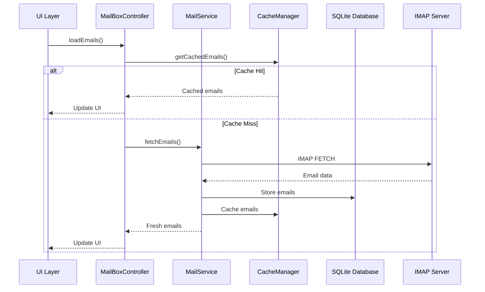
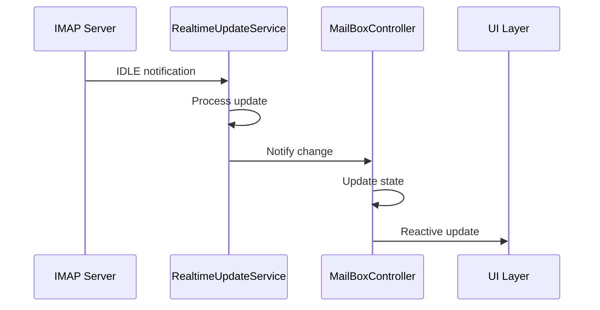

# 🏗️ Architecture Guide

This document provides a comprehensive overview of the Wahda Bank Email Client architecture, design patterns, and technical decisions.

## 📋 Table of Contents

- [Overview](#overview)
- [Architecture Patterns](#architecture-patterns)
- [Layer Structure](#layer-structure)
- [Data Flow](#data-flow)
- [State Management](#state-management)
- [Database Design](#database-design)
- [Security Architecture](#security-architecture)
- [Performance Considerations](#performance-considerations)

## 🎯 Overview

The Wahda Bank Email Client follows a **Clean Architecture** approach with **MVVM (Model-View-ViewModel)** pattern, implemented using **Flutter** and **GetX** for state management.

### Key Architectural Principles

1. **Separation of Concerns**: Clear separation between UI, business logic, and data layers
2. **Dependency Inversion**: High-level modules don't depend on low-level modules
3. **Single Responsibility**: Each class has a single, well-defined purpose
4. **Open/Closed Principle**: Open for extension, closed for modification
5. **Reactive Programming**: Event-driven architecture with reactive streams

## 🏛️ Architecture Patterns

### Clean Architecture Layers

```
┌─────────────────────────────────────────┐
│                 UI Layer                │
│  (Views, Widgets, Screens)              │
├─────────────────────────────────────────┤
│              Presentation               │
│  (Controllers, ViewModels)              │
├─────────────────────────────────────────┤
│               Domain                    │
│  (Use Cases, Entities, Repositories)   │
├─────────────────────────────────────────┤
│                Data                     │
│  (Services, APIs, Database)             │
└─────────────────────────────────────────┘
```

### MVVM Implementation

```dart
// Model (Data Layer)
class EmailRepository {
  Future<List<Email>> getEmails() async { ... }
}

// ViewModel (Presentation Layer)
class MailBoxController extends GetxController {
  final EmailRepository _repository;
  final RxList<Email> emails = <Email>[].obs;
  
  Future<void> loadEmails() async {
    final result = await _repository.getEmails();
    emails.assignAll(result);
  }
}

// View (UI Layer)
class EmailListView extends StatelessWidget {
  @override
  Widget build(BuildContext context) {
    return GetBuilder<MailBoxController>(
      builder: (controller) => ListView.builder(
        itemCount: controller.emails.length,
        itemBuilder: (context, index) => EmailTile(
          email: controller.emails[index],
        ),
      ),
    );
  }
}
```

## 📁 Layer Structure

### 1. Presentation Layer (`lib/views/`, `lib/widgets/`)

**Responsibility**: User interface and user interaction handling

```
views/
├── compose/              # Email composition screens
│   ├── compose.dart
│   └── models/
├── settings/             # Settings and configuration
│   ├── settings_view.dart
│   └── pages/
└── view/                 # Email viewing screens
    ├── screens/
    └── showmessage/
```

**Key Components**:
- **Screens**: Full-page views (Home, Settings, Compose)
- **Widgets**: Reusable UI components (MailTile, Drawer)
- **Pages**: Sub-screens within main screens

### 2. Application Layer (`lib/app/`)

**Responsibility**: Application-wide configuration and coordination

```
app/
├── bindings/             # Dependency injection
│   ├── home_binding.dart
│   └── initial_binding.dart
├── controllers/          # State management
│   ├── mailbox_controller.dart
│   ├── settings_controller.dart
│   └── auth_controller.dart
└── routes/              # Navigation configuration
    └── app_routes.dart
```

**Key Components**:
- **Controllers**: Business logic and state management
- **Bindings**: Dependency injection configuration
- **Routes**: Navigation and routing logic

### 3. Domain Layer (`lib/models/`, `lib/services/`)

**Responsibility**: Business logic and domain entities

```
models/                   # Domain entities
├── sqlite_database_helper.dart
├── sqlite_draft_repository.dart
└── sqlite_mime_storage.dart

services/                 # Business services
├── mail_service.dart
├── cache_manager.dart
├── realtime_update_service.dart
└── security_service.dart
```

**Key Components**:
- **Entities**: Core business objects (Email, Mailbox, User)
- **Services**: Business logic implementation
- **Repositories**: Data access abstractions

### 4. Infrastructure Layer (`lib/utils/`)

**Responsibility**: External concerns and utilities

```
utils/
├── functions.dart        # Utility functions
├── theme/               # UI theming
└── constants/           # Application constants
```

## 🔄 Data Flow

### Email Loading Flow



### Real-time Update Flow



## 🎛️ State Management

### GetX State Management Pattern

```dart
// Reactive State
class MailBoxController extends GetxController {
  // Observable variables
  final RxBool _isLoading = false.obs;
  final RxList<MimeMessage> _emails = <MimeMessage>[].obs;
  final Rx<Mailbox?> _currentMailbox = Rx<Mailbox?>(null);
  
  // Getters
  bool get isLoading => _isLoading.value;
  List<MimeMessage> get emails => _emails;
  Mailbox? get currentMailbox => _currentMailbox.value;
  
  // Actions
  Future<void> loadEmails() async {
    _isLoading.value = true;
    try {
      final emails = await _mailService.fetchEmails();
      _emails.assignAll(emails);
    } finally {
      _isLoading.value = false;
    }
  }
}
```

### State Lifecycle

1. **Initialization**: Controllers are created via dependency injection
2. **Loading**: Data is fetched from services and cached
3. **Updates**: Reactive variables trigger UI rebuilds
4. **Disposal**: Resources are cleaned up automatically

### Dependency Injection

```dart
class HomeBinding extends Bindings {
  @override
  void dependencies() {
    // Singleton services (permanent)
    Get.put<MailService>(MailService(), permanent: true);
    Get.put<CacheManager>(CacheManager(), permanent: true);
    
    // Lazy controllers (created when needed)
    Get.lazyPut<MailBoxController>(() => MailBoxController());
    Get.lazyPut<SettingController>(() => SettingController());
  }
}
```

## 🗄️ Database Design

### SQLite Schema

#### Entity Relationship Diagram

```
┌─────────────────┐    ┌─────────────────┐    ┌─────────────────┐
│    Messages     │    │     Drafts      │    │  Attachments    │
├─────────────────┤    ├─────────────────┤    ├─────────────────┤
│ id (PK)         │    │ id (PK)         │    │ id (PK)         │
│ uid             │    │ to_addresses    │    │ message_id (FK) │
│ sequence_id     │    │ cc_addresses    │    │ filename        │
│ mailbox_name    │    │ bcc_addresses   │    │ content_type    │
│ subject         │    │ subject         │    │ size            │
│ sender          │    │ body            │    │ data            │
│ recipients      │    │ is_html         │    └─────────────────┘
│ date_received   │    │ created_at      │
│ is_seen         │    │ updated_at      │
│ is_flagged      │    └─────────────────┘
│ is_deleted      │
│ is_draft        │
│ body_text       │
│ body_html       │
│ raw_message     │
└─────────────────┘
```

#### Database Operations

```dart
// Repository Pattern
abstract class EmailRepository {
  Future<List<MimeMessage>> getEmails(String mailboxName);
  Future<void> saveEmail(MimeMessage email);
  Future<void> deleteEmail(int id);
  Future<void> updateEmailFlags(int id, Map<String, bool> flags);
}

// Implementation
class SQLiteEmailRepository implements EmailRepository {
  final Database _database;
  
  @override
  Future<List<MimeMessage>> getEmails(String mailboxName) async {
    final maps = await _database.query(
      'messages',
      where: 'mailbox_name = ?',
      whereArgs: [mailboxName],
      orderBy: 'date_received DESC',
    );
    return maps.map((map) => MimeMessage.fromMap(map)).toList();
  }
}
```

## 🔒 Security Architecture

### Security Layers

```
┌─────────────────────────────────────────┐
│           Application Security          │
│  (App Lock, Biometric Auth)             │
├─────────────────────────────────────────┤
│           Transport Security            │
│  (TLS/SSL, Certificate Pinning)         │
├─────────────────────────────────────────┤
│            Data Security                │
│  (Encryption at Rest, Secure Storage)   │
├─────────────────────────────────────────┤
│          Authentication                 │
│  (OAuth2, App Passwords, 2FA)           │
└─────────────────────────────────────────┘
```

### Security Implementation

```dart
// Secure Storage
class SecurityService {
  static const _storage = FlutterSecureStorage();
  
  static Future<void> storeCredentials(String email, String password) async {
    final encryptedPassword = await _encrypt(password);
    await _storage.write(key: 'email_$email', value: encryptedPassword);
  }
  
  static Future<String?> getCredentials(String email) async {
    final encryptedPassword = await _storage.read(key: 'email_$email');
    return encryptedPassword != null ? await _decrypt(encryptedPassword) : null;
  }
}

// App Lock
class AppLockService {
  static Future<bool> authenticate() async {
    final isAvailable = await LocalAuthentication().isDeviceSupported();
    if (isAvailable) {
      return await LocalAuthentication().authenticate(
        localizedReason: 'Authenticate to access your emails',
        options: AuthenticationOptions(biometricOnly: true),
      );
    }
    return false;
  }
}
```

## ⚡ Performance Considerations

### Caching Strategy

#### Multi-Level Cache Architecture

```
┌─────────────────┐
│   L1: Memory    │  ← Fastest access (RAM)
│   (LRU Cache)   │
├─────────────────┤
│   L2: SQLite    │  ← Persistent storage
│   (Database)    │
├─────────────────┤
│   L3: File      │  ← Large attachments
│   (File System) │
└─────────────────┘
```

#### Cache Implementation

```dart
class CacheManager {
  // L1 Cache: In-memory LRU cache
  final LRUMap<String, MimeMessage> _messageCache = LRUMap(maxSize: 100);
  final LRUMap<String, Uint8List> _attachmentCache = LRUMap(maxSize: 50);
  
  // L2 Cache: SQLite database
  final SQLiteMimeStorage _storage = SQLiteMimeStorage.instance;
  
  // L3 Cache: File system
  final Directory _cacheDir = await getTemporaryDirectory();
  
  Future<MimeMessage?> getMessage(String key) async {
    // Try L1 cache first
    if (_messageCache.containsKey(key)) {
      return _messageCache[key];
    }
    
    // Try L2 cache
    final message = await _storage.getMessage(key);
    if (message != null) {
      _messageCache[key] = message;
      return message;
    }
    
    return null;
  }
}
```

### Memory Management

```dart
class MemoryManager {
  static Timer? _cleanupTimer;
  
  static void startPeriodicCleanup() {
    _cleanupTimer = Timer.periodic(Duration(minutes: 5), (_) {
      _performCleanup();
    });
  }
  
  static void _performCleanup() {
    // Clear old cache entries
    CacheManager.instance.clearOldEntries();
    
    // Force garbage collection
    GarbageCollector.collect();
    
    // Monitor memory usage
    _monitorMemoryUsage();
  }
}
```

### Lazy Loading

```dart
class LazyEmailList extends StatefulWidget {
  @override
  _LazyEmailListState createState() => _LazyEmailListState();
}

class _LazyEmailListState extends State<LazyEmailList> {
  final ScrollController _scrollController = ScrollController();
  
  @override
  void initState() {
    super.initState();
    _scrollController.addListener(_onScroll);
  }
  
  void _onScroll() {
    if (_scrollController.position.pixels >= 
        _scrollController.position.maxScrollExtent * 0.8) {
      // Load more emails when 80% scrolled
      Get.find<MailBoxController>().loadMoreEmails();
    }
  }
}
```

## 🔄 Reactive Programming

### Stream-based Architecture

```dart
class RealtimeUpdateService {
  final StreamController<MailboxUpdate> _mailboxController = 
      StreamController<MailboxUpdate>.broadcast();
  
  Stream<MailboxUpdate> get mailboxUpdates => _mailboxController.stream;
  
  void _handleImapIdle(ImapEvent event) {
    final update = MailboxUpdate(
      type: event.type,
      mailbox: event.mailbox,
      messages: event.messages,
    );
    _mailboxController.add(update);
  }
}

// Usage in Controller
class MailBoxController extends GetxController {
  StreamSubscription? _updateSubscription;
  
  @override
  void onInit() {
    super.onInit();
    _updateSubscription = RealtimeUpdateService.instance
        .mailboxUpdates
        .listen(_handleMailboxUpdate);
  }
  
  void _handleMailboxUpdate(MailboxUpdate update) {
    // Update local state based on server changes
    switch (update.type) {
      case UpdateType.newMessage:
        _addNewMessage(update.messages.first);
        break;
      case UpdateType.messageDeleted:
        _removeMessage(update.messages.first);
        break;
    }
  }
}
```

## 🧪 Testing Architecture

### Test Structure

```
test/
├── unit/                 # Unit tests
│   ├── controllers/
│   ├── services/
│   └── models/
├── widget/              # Widget tests
│   ├── screens/
│   └── widgets/
└── integration/         # Integration tests
    ├── email_flow_test.dart
    └── settings_test.dart
```

### Testing Patterns

```dart
// Unit Test Example
class MockMailService extends Mock implements MailService {}

void main() {
  group('MailBoxController Tests', () {
    late MailBoxController controller;
    late MockMailService mockMailService;
    
    setUp(() {
      mockMailService = MockMailService();
      Get.put<MailService>(mockMailService);
      controller = MailBoxController();
    });
    
    test('should load emails successfully', () async {
      // Arrange
      final mockEmails = [MimeMessage(), MimeMessage()];
      when(mockMailService.fetchEmails()).thenAnswer((_) async => mockEmails);
      
      // Act
      await controller.loadEmails();
      
      // Assert
      expect(controller.emails.length, equals(2));
      verify(mockMailService.fetchEmails()).called(1);
    });
  });
}
```

## 📊 Monitoring & Analytics

### Performance Monitoring

```dart
class PerformanceMonitor {
  static void trackEmailLoad(String mailbox, Duration duration, int count) {
    Analytics.track('email_load_performance', {
      'mailbox': mailbox,
      'duration_ms': duration.inMilliseconds,
      'message_count': count,
      'timestamp': DateTime.now().toIso8601String(),
    });
  }
  
  static void trackCacheHitRate(String cacheType, double hitRate) {
    Analytics.track('cache_performance', {
      'cache_type': cacheType,
      'hit_rate': hitRate,
      'timestamp': DateTime.now().toIso8601String(),
    });
  }
}
```

## 🔮 Future Considerations

### Scalability

1. **Microservices**: Split services into smaller, focused modules
2. **Event Sourcing**: Implement event-driven architecture for better auditability
3. **CQRS**: Separate read and write operations for better performance

### Technology Evolution

1. **Flutter Web**: Enhanced web support with better performance
2. **Desktop Support**: Native Windows, macOS, and Linux applications
3. **AI Integration**: Smart email categorization and response suggestions

---

## 📚 References

- [Clean Architecture by Robert C. Martin](https://blog.cleancoder.com/uncle-bob/2012/08/13/the-clean-architecture.html)
- [Flutter Architecture Samples](https://github.com/brianegan/flutter_architecture_samples)
- [GetX Pattern](https://github.com/jonataslaw/getx/blob/master/documentation/en_US/state_management.md)
- [Reactive Programming](https://reactivex.io/)

For implementation details, see the [Development Guide](DEVELOPMENT.md).

