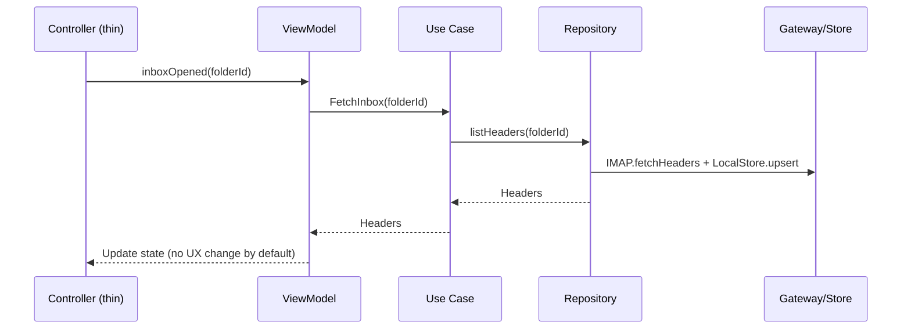
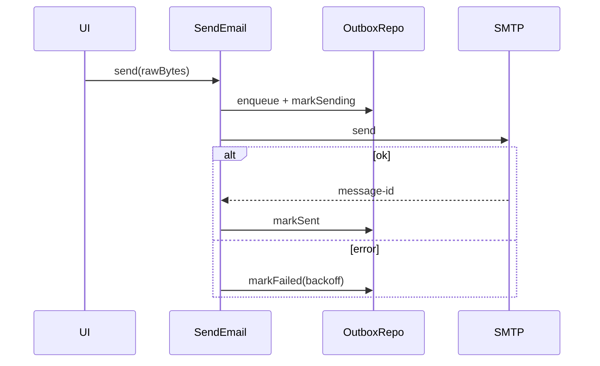

# 🏗️ Architecture Guide — DDD v2

This document is the **authoritative replacement** for the legacy Architecture Guide. It reflects the *feature‑first, DDD + Clean Architecture* migration completed in P0–P11 and the controller gating added in P12. Keep this doc in sync with the codebase.

---

## 📋 Contents

* [Overview](#overview)
* [Directory Layout](#directory-layout)
* [Layering Rules & Guardrails](#layering-rules--guardrails)
* [Dependency Injection & Feature Flags](#dependency-injection--feature-flags)
* [Error Taxonomy](#error-taxonomy)
* [Telemetry, Logging & Tracing](#telemetry-logging--tracing)
* [Feature Modules](#feature-modules)

  * [Messaging](#messaging)
  * [Sync](#sync)
  * [Search](#search)
  * [Rendering](#rendering)
  * [Send & Outbox](#send--outbox)
  * [Enterprise API](#enterprise-api)
  * [Security](#security)
  * [Notifications](#notifications)
  * [Settings](#settings)
* [Key Data Flows](#key-data-flows)
* [Caching & Storage](#caching--storage)
* [Performance Budgets](#performance-budgets)
* [Platform Considerations](#platform-considerations)
* [Testing Strategy](#testing-strategy)
* [Rollout & Kill Switch](#rollout--kill-switch)
* [Legacy → DDD Mapping](#legacy--ddd-mapping)

---

## Overview

We use **Domain‑Driven Design** with **Clean Architecture** in a **feature‑first** layout:

* **Features**: `messaging`, `sync`, `search`, `rendering`, `enterprise_api`, `security`, `notifications`, `settings`.
* **Layers by feature**: `domain`, `application`, `infrastructure`, `presentation` (UI lives outside features in existing GetX controllers; P12 adds *flag‑gated* routing).
* **Principles**: separation of concerns, dependency inversion, testability, and incremental migration (legacy path remains default until rollout).

## Directory Layout

```
lib/
  features/
    <feature>/
      domain/            # entities, value objects, repositories, services (interfaces)
      application/       # use cases (orchestration only)
      infrastructure/    # gateways, DAOs, mappers, repositories impl, DI modules
      presentation/    # active ViewModels (feature-scoped); UI widgets bind to VMs
  shared/
    di/                  # get_it + injectable bootstrap
    logging/             # Telemetry helper (PII‑safe)
    error/               # Sealed error taxonomy
    config/              # DddConfig caps & constants
    utils/, types/, testing/
```

## Layering Rules & Guardrails

* **Domain**: *no* Flutter SDK, *no* platform/DB/SDK imports.
* **Application**: orchestrates repositories/services; *no* IO or SDKs.
* **Infrastructure**: the only layer that talks to SDKs (IMAP/SMTP, REST, storage).
* **Presentation**: UI/controllers; call use cases/facades **via DI**.
* **Import Enforcer**: run via `dart run tool/import_enforcer.dart` on every CI/commit.

## Dependency Injection & Feature Flags

* **DI**: `get_it` + `injectable`. Bootstrap in `shared/di/injection.dart`.
* **Feature flags** (GetStorage‑backed):

  * `ddd.messaging.enabled`, `ddd.send.enabled`, `ddd.search.enabled`, `ddd.notifications.enabled`, `ddd.enterprise_api.enabled`, `ddd.sync.shadow_mode`.
  * **Kill switch**: `ddd.kill_switch.enabled` — **overrides all** and forces **legacy** routing.
* **Presentation orchestration**: ViewModels (MailboxViewModel, ComposeViewModel, SearchViewModel) own UI orchestration; legacy controllers are @Deprecated thin adapters that delegate to VMs. The old `shared/ddd_ui_wiring.dart` shim was removed in **P12.3**.

## Error Taxonomy

All gateways map errors to sealed classes in `shared/error/errors.dart`:

* `AuthError`, `RateLimitError`, `TransientNetworkError`, `PermanentProtocolError`,
* `StorageCorruptionError`, `RenderingError`,
* Crypto: `CryptoError`, `DecryptionError`, `SignatureInvalidError`, `KeyNotFoundError`.

## Telemetry, Logging & Tracing

* **Telemetry**: `Telemetry.event/time/timeAsync` with PII‑safe IDs (hashed). Fields: `op, folder_id, request_id, path, lat_ms, error_class, cache`.
* **Spans** (env‑gated export): `FetchHeaders`, `PersistHeaders`, `FetchBody`, `RenderHtml`, `SendSmtp`, `IdleLoop`.
* **Budgets** tracked: inbox open p50 ≤ 600ms; cached message open p50 ≤ 200ms; sync cycle p50 ≤ 1500ms; DB cap ≤ 800MB; battery drain ≤ 2%/day.

## Feature Modules

### Messaging

* **Domain**: `Message`, `Folder`, `Thread`, flags & addresses VOs; repo interfaces.
* **Infra**: IMAP gateway (headers/body/attachments), local store (metadata, bodies, attachments), mapping, repository impl.
* **Search**: local‑first; remote stub optional; dedupe + sort by date desc; limit.

### Sync

* **Idle** stream via gateway emits `ImapEvent(exists|expunge|flagsChanged)`.
* **Shadow mode** service coalesces events (300ms); header‑first refresh; retries with jitter; telemetry on `IdleLoop`.

### Search

* `SearchQuery` VO; `SearchResult` entity.
* Repo performs metadata LIKE + optional body (if cached); remote stub disabled by default.

### Rendering

* `MessageRenderingService` → `RenderedContent { sanitizedHtml, plainText?, hasRemoteAssets, inlineImages }`.
* `HtmlSanitizer` strips `<script>`, `<iframe>`, inline `on*`, external CSS, `javascript:`; blocks **remote images** by default; `allowRemote=true` overrides. Also strips `data:` image sources, `srcset`, and dangerous `style=url(...)`.
* `CidResolver` maps `cid:` to cached attachments; no network.
* `PreviewCache` (LRU=100) with hit/miss/evict telemetry.

### Send & Outbox

* `SendEmail` use case: Draft → Outbox → SMTP send; idempotent, backoff `1m, 5m, 30m, 2h` capped at 24h; telemetry `SendSmtp`.

### Enterprise API

* REST gateway over `MailsysApiClient`; 401/403 → `AuthError`, 429 → `RateLimitError` (retry/backoff 1s→60s), 5xx → `TransientNetworkError`.
* Token store, mappers, and repos for account profile, contacts, signatures.

### Security

* `CryptoEngine` interface; `EncryptionService` orchestrates crypto + keyring.
* In‑memory keyring & trust repo; stub crypto engine (no real PGP/S/MIME in P8).

### Notifications

* Domain events (`NewMessageArrived`, `MessageFlagChanged`, `SyncFailed`); `NotificationPort` interface.
* No‑op adapter + coordinator (disabled by default); settings‑aware payload mapping.

### Settings

* Typed getters/setters (quiet hours, sound/vibrate, grouping, max notifications, allow remote images) backed by GetStorage with defaults & migration.

## Key Data Flows





## Caching & Storage

* **Bodies**: LRU by `lastOpenedAt`; **protected** items (starred/answered) never evicted. Total cap **200 MB**.
* **Attachments**: LRU with **per‑item ≤ 100 MB**; total cap **400 MB**; too‑large items skip cache (telemetry reason=`too_large_to_cache`).
* **Preview cache**: LRU **100** entries.
* **Indices**: forward‑only migration for metadata queries: `date DESC`, `(from,subject)`, `(flags,date)`.

## Performance Budgets

* inbox\_open\_ms\_p50 ≤ **600ms**
* message\_open\_ms\_p50\_cached ≤ **200ms**
* sync\_cycle\_ms\_p50 ≤ **1500ms**
* battery\_drain\_per\_day\_pct ≤ **2%**
* db\_size\_mb\_cap ≤ **800MB**

## Platform Considerations

* **iOS background** (P14): IMAP IDLE may be throttled; we schedule BGAppRefresh via Workmanager and perform header-first refresh with a 3–5s coalescing window. A CircuitBreaker guards flaky networks (open→half‑open→closed) with jittered reopen. Connectivity regain resets the breaker and triggers a single debounced refresh. Kill‑switch (`ddd.kill_switch.enabled`) takes absolute precedence.
* **Network changes**: detect connectivity, re‑establish IMAP sessions with jittered backoff and circuit breaker.

## Testing Strategy

* Unit tests for use cases, gateways (error mapping), repositories, sanitizer, caches, sync coalescing, retry/backoff.
* Property tests for addresses/MIME decoding.
* Scriptable IMAP fakes; golden tests for HTML rendering & RTL.
* CI runs **unit tests only**; device/emulator CI deferred.

## Rollout & Kill Switch

* Remote‑flagged staged rollout (planned): pilot 5% → 25% → 100%; monitor error rate <2% and budgets.
* **Kill switch**: single remote flag `ddd.kill_switch.enabled` routes everything to **legacy**; persists across restarts.

## Legacy → DDD Mapping

| Legacy area                      | DDD replacement                                                   |
| -------------------------------- | ----------------------------------------------------------------- |
| `lib/services/mail_service.dart` | `features/messaging/...` repo + facade (DI)                       |
| `lib/models/sqlite_*` + `hive_*` | `infrastructure/datasources/*` + DTOs + mappers                   |
| `realtime_update_service.dart`   | `features/sync/infrastructure/sync_service.dart`                  |
| Rendering in UI widgets          | `features/rendering/infrastructure/*` + `MessageRenderingService` |
| Ad‑hoc networking                | Gateways (`imap_gateway.dart`, `smtp_gateway.dart`, REST gateway) |
| Notifications in UI              | `features/notifications` domain + no‑op adapter (flag‑gated)      |
| Security service                 | `features/security` keyring/trust + `CryptoEngine` stub           |

> **Note:** Since **P12.3**, controllers are deprecated thin adapters that delegate to **feature/presentation ViewModels**; the `shared/ddd_ui_wiring.dart` shim has been **removed**.
